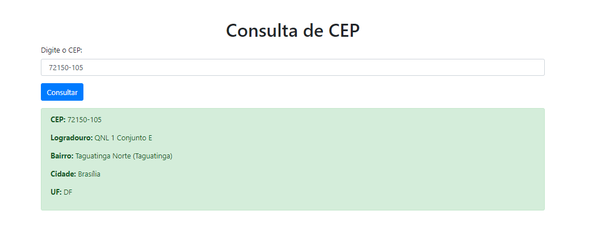

# Projeto de Estudo de Consulta de CEP com API

Este projeto foi desenvolvido para fins de estudo e prática da utilização de uma API para consulta de CEP.



## Funcionalidades

- Consulta de CEP via API
- Exibição dos dados de endereço retornados

## Tecnologias Utilizadas

- PHP
- HTML
- CSS (Bootstrap)
- API ViaCEP

## Como Usar

1. Clone o repositório:
   ```bash
   git clone https://github.com/seu-usuario/seu-repositorio.git
